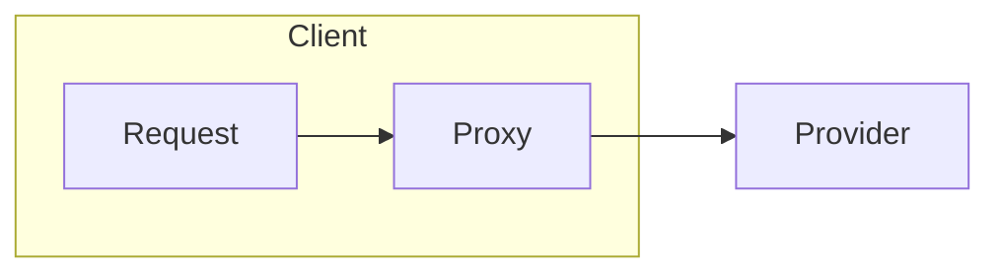

## 代理层设计

```java
public static void main(String[] args) {
    Server server = new Server(localhost, port);
    server.doConnect();
    Object sendResponse = server.doRef("sendMail", "这是一条消息");
    System.out.println(sendResponse);
}
```



## 路由层设计


## 代理层实现

开启客户端开启新的线程发送数据包给服务器, 解耦

代理对象会检查是否得到 RpcInvocation 对象, 并返回 RpcInvocation 的 response object.

