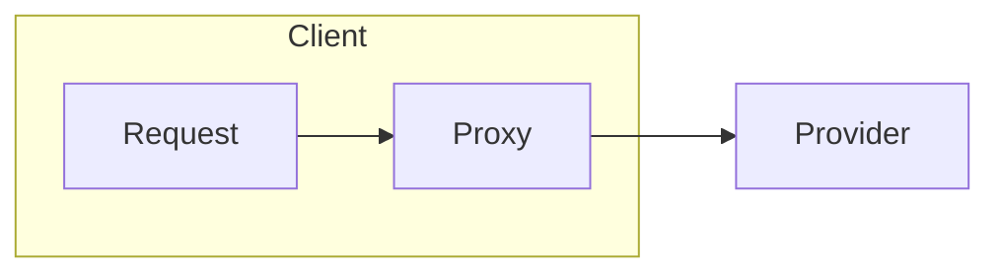
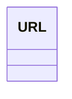

# 项目笔记

## 总体设计

### 代理层设计

```java
public static void main(String[] args) {
    Server server = new Server(localhost, port);
    server.doConnect();
    Object sendResponse = server.doRef("sendMail", "这是一条消息");
    System.out.println(sendResponse);
}
```



### 路由层设计


## 代理层实现

开启客户端开启新的线程发送数据包给服务器, 解耦.
具体流程是将对象放入BlockingQueue, 发送线程有个死循环不断take

代理对象会检查是否得到 RpcInvocation 对象, 并返回 RpcInvocation 的 response object.


注:
服务提供者其实和类的权限定名有很大的关系

## 注册中心的接入和实现
在`ZookeeperRegister`中, 服务更新(`UrlChangeWrapper`) 会被包装成事件(event), 通过`ListenerLoader`
发送事件, 里面会开启线程池异步执行event.callback, event的callback会移除无用节点, 添加新节点到本地缓存, 也就是
`CONNECT_MAP`, 其中
`Map<String, List<ChannelFutureWrapper>> CONNECT_MAP`

### 关键类



## 路由层

