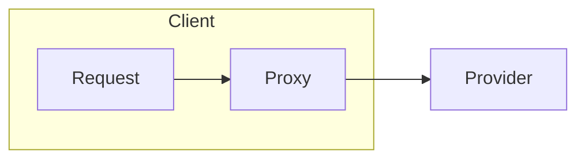
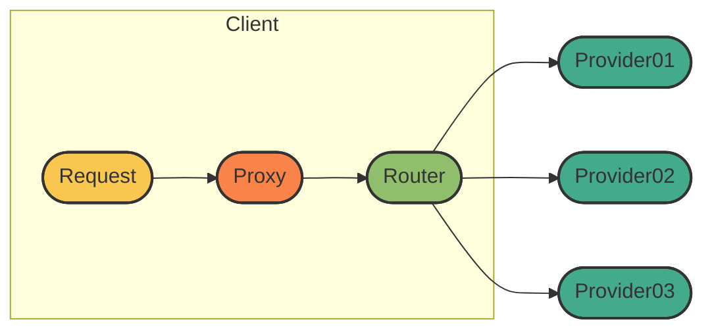

## 代理层设计

```java
public static void main(String[] args) {
    Server server = new Server(localhost, port);
    server.doConnect();
    Object sendResponse = server.doRef("sendMail", "这是一条消息");
    System.out.println(sendResponse);
}
```



## 路由层设计

