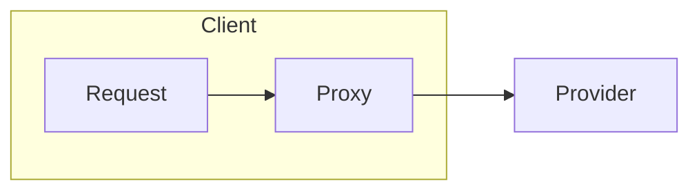
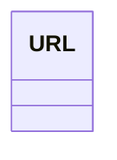

# 项目笔记

## 简历内容

### Lastest

轻量级分布式 RPC 框架

Netty、Zookeeper、Fastjson、SpringBoot

#### 项目描述

独立设计并实现一套轻量级、高性能的分布式 RPC 框架，支持服务注册与发现、通信协议编解码、负载均衡、容错与限流策略等核心模块，具备完整服务治理能力。
核心工作：	
* 架构设计理念：遵循 Client Stub / Server Stub 分层思想，设计代理层、协议层、路由层、注册中心层、容错限流层、接入层等九大核心模块，确保职责单一、功能解耦、易于扩展
* 代理层：基于 Netty 和 Java 反射代理实现高性能 NIO 通信
* 协议层：实现自定义通信协议，支持 Java、Fastjson 等序列化方式，解决粘包拆包问题
* 服务注册中心：基于 Zookeeper 实现服务注册/发现，支持 Watcher 实时监听
* 负载均衡策略：实现轮询、随机等多种策略，设计统一路由接口支持动态切换
* 容错策略：服务端异常传输给服务调用方；加入超时重试机制；采用了 Semaphore 实现服务连接限流
* 责任链式插件机制：通过 FilterChain 模式扩展自定义链路处理逻辑，如自定义条件过滤、服务分组等
* SpringBoot Starter 接入：封装注解与自动装配模块，简化业务接入成本
* 测试与监控：使用 JMeter 进行性能测试，在6核16G机器上模拟1w并发请求，QPS 提升至1k+

#### 项目难点：	

* 完整掌握 RPC 框架设计思路，项目模块高度解耦、结构清晰，具备开源级维护与拓展能力
* 设计 NIO 高性能通信与协议，强化系统容错与限流机制
* 适配 SpringBoot 项目快速接入，已部署至测试环境验证，具有工程可用性与稳定性

### 简历上可能问到的问题

1. 为何不使用 Java 自带的序列化方式?
2. QPS 达到 1k+ 合理么? 
3. 还有那些地方会用到责任链?
   > netty中，处理传输数据的多个handler也是责任链模式
   > Tomcat的ApplicationFilterChain


### older version

#### 项目描述

独立设计并实现一套轻量级、高性能的分布式 RPC 框架，
支持服务注册与发现、通信协议编解码、负载均衡、容错与熔断策略等核心模块，
具备完整服务治理能力。
适用于中小型微服务架构，部署灵活，兼容性强。

#### 核心工作：

- 协议层：实现自定义通信协议，支持 Java、Fastjson、Protobuf 等序列化方式，解决粘包拆包问题。
- 通信层：基于 Netty 实现高性能 NIO 通信，支持心跳检测、空闲连接释放。
- 服务注册中心：基于 Zookeeper 实现服务注册/发现，支持客户端缓存及 Watcher 实时监听。
- 负载均衡策略：实现轮询、随机、LRU、一致性哈希等多种策略。
- 容错策略：集成 Guava-Retry 实现幂等性服务自动重试，支持指定重试次数。
- 降级与限流：服务端实现故障通知与限流（令牌桶）；客户端集成熔断器，实现服务熔断保护。
- 测试与监控：使用 JMH、JMeter 进行性能测试；通过 Spring AOP 采集调用日志，输出至 ElasticSearch。
- 在1核2G机器上模拟1w并发请求，GC次数降低30%，QPS 提升至7k+

#### 项目难点：

- 通信协议兼容性与性能优化权衡；Channel 生命周期管理
- 客户端本地缓存同步与 Watch 机制实现；容错熔断状态转换复杂度高
- 高并发链路日志追踪设计；调用链观测覆盖完整系统调用路径

## 总体设计

- 根据配置生成不同的代理类
- 根据配置选择不同的负载均衡策略
- 根据配置使用不同的序列化方式
  - client 和 server 之间是否需要告知?

### 代理层设计

```java
public static void main(String[] args) {
    Server server = new Server(localhost, port);
    server.doConnect();
    Object sendResponse = server.doRef("sendMail", "这是一条消息");
    System.out.println(sendResponse);
}
```



### 路由层设计


## 代理层实现

开启客户端开启新的线程发送数据包给服务器, 解耦.
具体流程是将对象放入BlockingQueue, 发送线程有个死循环不断take

代理对象会检查是否得到 RpcInvocation 对象, 并返回 RpcInvocation 的 response object.


注:
服务提供者其实和类的权限定名有很大的关系

## 注册中心的接入和实现
在`ZookeeperRegister`中, 服务更新(`UrlChangeWrapper`) 会被包装成事件(event), 通过`ListenerLoader`
发送事件, 里面会开启线程池异步执行event.callback, event的callback会移除无用节点, 添加新节点到本地缓存, 也就是
`CONNECT_MAP`, 其中
`Map<String, List<ChannelFutureWrapper>> CONNECT_MAP`

### 关键类



## 路由层

## filter

服务端的责任链我是放在了ChannelInboundHandlerAdapter中，
但是客户端的责任链并没有放在ChannelOutboundHandlerAdapter中，
因为客户端的责任链需要在确认具体channel之前做筛选，
而在ChannelOutboundHandlerAdapter通常是在已经确认了channel且只能对单个channel生效。

> netty中，处理传输数据的多个handler也是责任链模式
> Tomcat的ApplicationFilterChain

## Service provider interface

将用户自定义的代码加入RPC框架. 通过配置读取

## 面试技巧

1. 引导面试官到擅长的领域